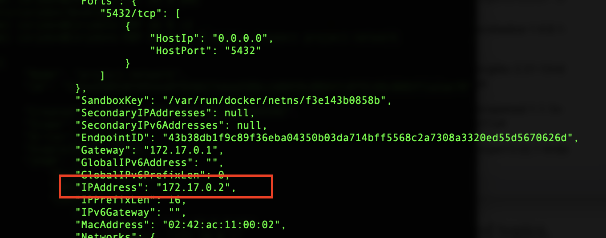

## How to run Django Development Server

---
*Using the built in Django development server is beneficial for when changes are being made actively to the Django code base. It will watch the files 
for changes and automatically incorporate them.*
1) Create Virtual Env in your host machine.

2) Then, install all the required dependencies from requirements.txt

3) Ensure that the postgres database host is set to your local version's address.

4) Go to Project Directory and run this Script `python3 manage.py runserver` or `django-admin manage.py runserver`

5) Go to `http://127.0.0.1:8000/` page and see if the application. 
   - Go to http://127.0.0.1:8000/login/user/ for Login.

## Setting Up Full Stack Development Environment

---
*Runing all or part of this stack can be benficial for testing how the application will perform in a simulated 
production environment. Configuring the postgres database can be benficial for using in conjunction with the Django development server*

### Pre-requisites:
- Docker installed
- Clone project repository from GitHub


### Create Postgres Container


1) Pull down official Postgresql Docker image from [Docker Hub](https://hub.docker.com/_/postgres) by running `docker pull postgres:latest`

2) Start postgres container and bind to local port 5432 `--name postgres-db -p 5432:5432 -e POSTGRES_PASSWORD=password -d postgres`

3) The container is now running and listening to the local host on port 5432

4) Identify the container local IP address run `docker inspect postgres-db`
   - The terminal will print out a long JSON document, look for the line that says IP address and make note of this value
    


### Create the PgAdmin4 Container


1) Pull down the official PgAdmin4 Docker image from [Docker Hub](https://hub.docker.com/r/dpage/pgadmin4/) by running `docker pull dpage/pgadmin4:latest`

2) Run the container on local port 8080 and set the default credentials 
   ```shell
   run -p 8080:80 \
    --name pgadmin \
    -e 'PGADMIN_DEFAULT_EMAIL={your.email@domain.com}' \
    -e 'PGADMIN_DEFAULT_PASSWORD=SuperSecret' \
    -d dpage/pgadmin4
   ```
3) Navigate to http://localhost:8080 in your browser

4) Login using the credentials you set in step 2

5) Right click on *servers* in the top left-hand corner, then select register > server

6) Enter the information for the Postgres container

   1) **Name:** can be whatever you like, then click on the connection tab
   
   2) **Host:** should be the IP address copied in step 4 from the previous section
   
   3) **Port:** should be 5432
   
   4) **Username:** postgres
   
   5) **Password:** password from step 2 in previous section
   
   6) Lave all other fields as default and click save
   
7) The connection should be saved and the server should be shown in the left-hand navigation

8) Right-click on the databases under server name and select create database name the database `calorie_tracker`
 

9) If using a backup file to configure the database (reccomended) right-click on the database name and select *Restore*


### Create the Django Container


1) First we must configure the container network to ensure that the Postgres container and the Django app can communicate

   1) run `docker network create django-app-network`
   
   2) Now add the postgres container to the network run `docker network connect django-app-network postgres-db`
   
   3) Check the database IP address on the network by running `docker inspect django-app-network` and finding the IPv4Address value of the postgres container
   
2) Open a terminal in the `/code/Project/` directory

3) Ensure that you have added any new requirements to `requirements.txt`

4) Ensure that the host for the database in the settings.py file is set to `postgres-db` or the IP address of the db container found in step 1

5) Run the command `docker build -t test-project .` to create the Docker image

6) Run the command `docker run --name django-project -p 8000:8000 test-project:latest` to start the container

7) Run the command `docker network connect django-app-network django-project` to connect the Django container to the container network.

8) Browse to the Django container in the browser at `http://lcoalhost:8000/login/user/`
