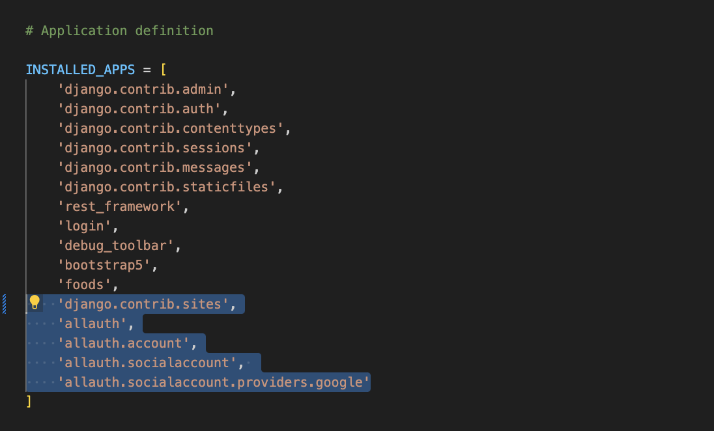
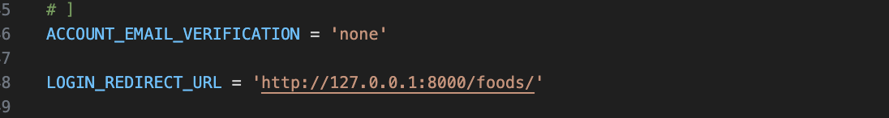
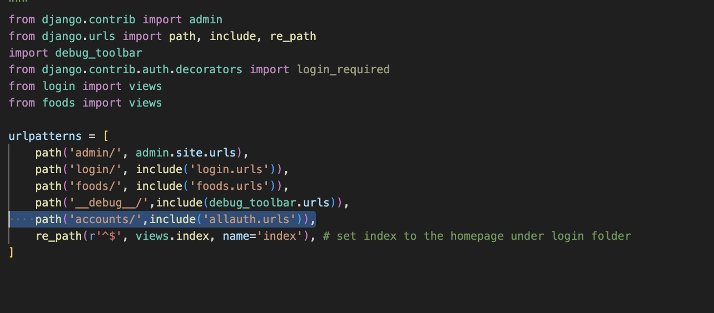
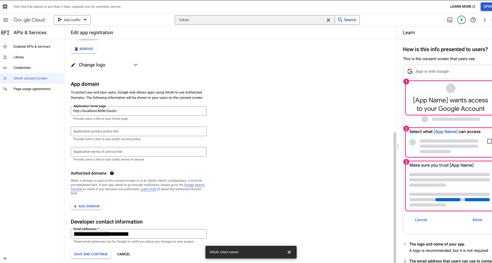
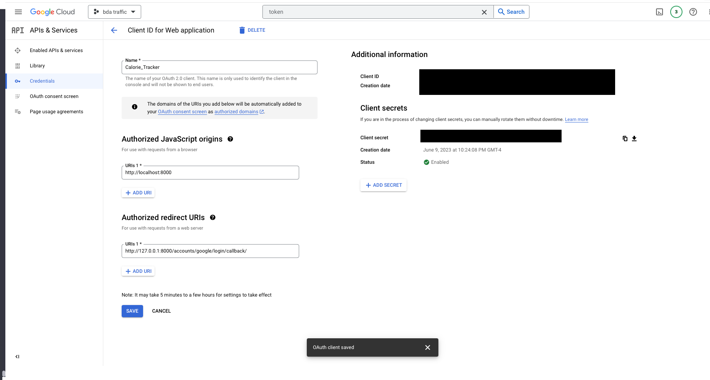
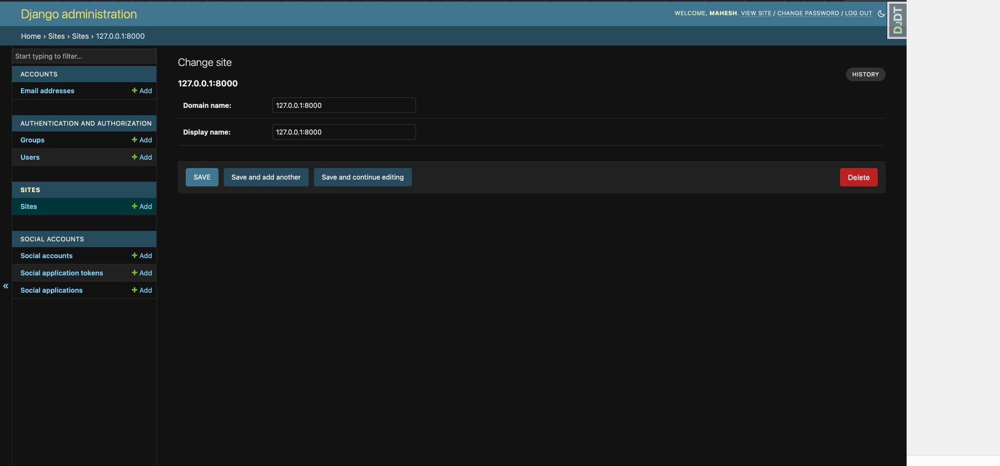
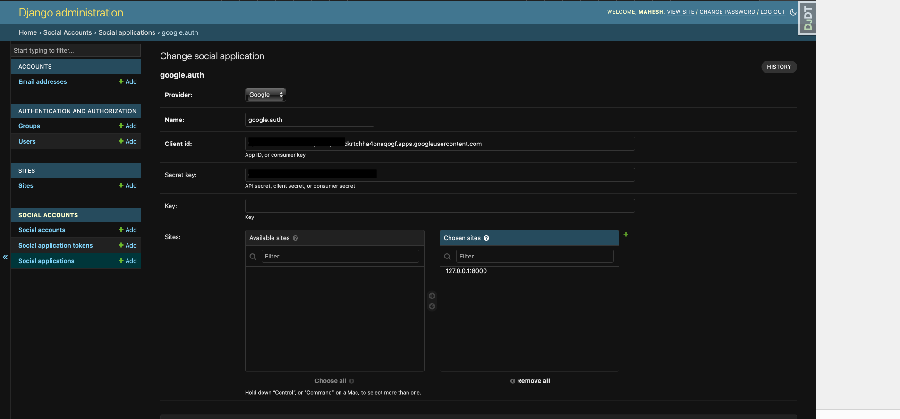

### Installation

``` Terminal
pip3 install django-allauth
```


### Setup

Open settings.py and do following changes in INSTALLED_APPS

    

Add these lines in main 'settings.py'
    

---
Now open urls.py of the main project and add below line,
    


### Setup Google APIs
---

First, go to https://console.cloud.google.com/apis/ and create a project , then go to the Oauth consent screen and fill in the information shown in the below image and save & continue.
    
    

Go to credentials and click create credentials and then click OAuth client ID


Click on it and choose web application, and add these two URLs,
    - `http://127.0.0.1:8000 for Authorized JavaScript origins`
    - `"Your redirect URI" for Authorized redirect URIs`
    

You get your Client ID and Client Secret as shown in above image. Copy those keys.

### Add a social app in Django admin

First, migrate

``` Terminal
python manage.py migrate
```

assuming you’ve already created a superuser if not then create using,

``` Terminal
python manage.py createsuperuser
```


### Setting up Django Admin Page 
Now run the server using python manage.py runserver and open django admin page. Go to this page http://127.0.0.1:8000/admin/sites/site/2/change/ and make these changes,
    

Then, click on Social Applications click Add and fill in the details as follows

Provider: Google
Name: OAuth App
Client id: [YOUR GOOGLE AUTH CLIENT ID]
Secret key: [YOUR GOOGLE AUTH CLIENT SECRET]
Sites: 127.0.0.1:8000
    

###  Modify login.html file in the login app, Template folder

``` In login.html file 

    
    <h1>Google Login</h1>
    <a href="?next=/">Login with Google</a> 

```

